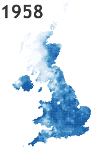

- [QGIS: generare un atlante basato su campi](#qgis-generare-un-atlante-basato-su-campi)
  - [Come creare l'atlante](#come-creare-latlante)
  - [Divertissement](#divertissement)

# QGIS: generare un atlante basato su campi

L'**atlante** di **QGIS** consente di creare in modo automatico delle pubblicazioni cartografiche multipagina. Proprio come i meravigliosi volumi del tempo della **scuola** (in cui ci si perdeva letteralmente dentro, specie "noi di quando non c'era l'internèt").


Esistono tanti *tutorial* sul come farne uno e non replicherò. Documenterò qui una modalità un po' atipica e di grande utilità. Tutto nasce da questo messaggio dell'insuperabile [**@puntofisso**](https://twitter.com/puntofisso) (Giusppe Sollazzo), ricevuto qualche giorno fa:

> *Borruso, sei la mia ultima speranza, stile Obi Wan. Posso chiederti una domanda QGIS? :)
Sto cercando di capire se mi stia sfuggendo qualcosa di ovvio sulla generazione di un Atlas [...]. Ho un dataset che mostra le precipitazione storiche in UK in termini di decili, per mostrare quando le precipitazioni sono state fuori dal comune.[...]<br>
Posso trasporlo, splittare le coordinate (in easting, northing), etc... ma faccio fatica a pensare a una struttura che sia compatibile con Atlas per cui possa alla fine ottenere una mappa per anno*


A partire da un dataset come quello soprastante si vuole realizzare un **atlante** con una pagina per anno, senza cambiare l'area geografica. Quindi si dovrà fare **riferimento** a un **diverso campo**, a una diversa fonte dati.<br>
Di solito avviene proprio il contrario: la variazione di pagina è in base alle righe di un *layer* (ad esempio al cambio di nome nella colonna "nome regione"), con taglio geografico diverso per ognuna.

L'obiettivo è quindi ottenere qualcosa come quella di sotto (le `n` pagine corrispondenti agli anni dei dati sorgente).


## Come creare l'atlante

Il punto di partenza è quello di caricare i *layer* cartografici di base. Nell'esempio creato per descrivere la procedura faccio uso soltanto di un [file CSV](./atlante/decilesNE.csv) (denominato `decilesNE.csv`), con una struttura come quella della tabella in alto, più due colonne con le coordinate.<br>
Una volta aggiunto, si formatta il *layer* sfruttando i valori di una delle colonne `year...`, che contengono valori da `0` a `9`.<br>
Sono **dieci classi** a cui ad esempio associare dei toni dal bianco al blu, al passaggio da `0` a `9`. Si tratta di punti che rappresentano quadrati di 5 chilometri e a cui verrà associato pertanto un simbolo quadrato di 5 km di lato.


Per poter **paginare per anno** verrà aggiunto un *layer* con i valori **distinti per anno**, ma **disposti in righe**. Basta quindi trasporre la riga con il nome delle colonne del file di input e ottenere un CSV come [questo](./atlante/at.csv) (che ho chiamato `at.csv`).<br>
Una volta creato, si dovrà aggiunge al progetto.

Si potrà iniziare dal creare un nuovo *layout* e attivare in questo la **generazione** dell'atlante.<br>
Due i paramentri importanti in questa fase:

1. quale *layer* farà da `coverage`, ovvero quale "comanderà" il cambio pagina. Per questo progetto sarà `at`;
2. quale **campo** utilizzare per **ordinare** le **pagine**. Sarà `item`, l'unico del file `at.csv`, che contiene l'elenco dei nomi delle colonne (che corrispondono agli anni).


In questo modo QGIS sa come paginare (vedi sotto).


Rimane però un **PROBLEMA**: come fare in modo che al cambio pagina la **formattazione** della **mappa** sia **basata** sul **campo** **corrispondente** all'**anno selezionato**?

Al momento la formattazione è basata su una delle colonne del *layer*. Quindi **al cambio pagina non varierà**.<br>
QGIS espone alcune **variabili** legate agli atlanti, una è denominata [`@atlas_pagename`](http://hfcqgis.opendatasicilia.it/it/latest/gr_funzioni/variabili/README.html) e contiene il valore del nome della **pagina corrente**.<br>
Quindi basterebbe usare questa variabile al posto del nome della colonna, e fare in modo che il *layer* spaziale vari al cambio di pagina.

Per farlo bisogna aprire il pannello di formattazione del *layer* e sostituire il nome del campo con l'espressione `eval(@atlas_pagename)` (vedi sotto). <br>
Si usa la funzione [`eval`](http://hfcqgis.opendatasicilia.it/it/latest/gr_funzioni/generale/eval.html) per fare in modo che il valore della variabile (ad esempio `year1958`) sia mappato come nome campo e non come stringa.


A questo punto si potrà esportare l'atlante in `PDF`, in `SVG` e in `PNG`.

Ho creato una [copia del file progetto](./atlante/atlante.zip) con le risorse necessarie (creato con QGIS 3.4), in modo che sia possibile testare il tutto in autonomia. All'interno il *layout* con l'atlante, denominato `miSollazzo`.<br>
**NOTA BENE**: all'apertura del progetto il *layer* non sarà visualizzato, perché l'atlante non è attivo e quindi QGIS non sa quale sia la pagina e di conseguenza quale il campo da usare per formattare il *layer*. Allora, una volta aperto il progetto, si dovrà aprire il *layout* presente e attivare l'anteprima dell'atlante.

## Divertissement

Durante la preparazione di questo articolo mi sono divertito a utilizzare l'*output* dell'atlante per creare due cose:

- la **griglia** di **immagini** presente a inizio post;
- una **gif animata** che mostri le variazioni nel tempo.

Per farlo, ho esportato le pagine dell'atlante in `png` e le ho elaborate con [ImageMagick](https://imagemagick.org).

La **griglia** si può creare con l'*utility* [`montage`](https://imagemagick.org/script/montage.php), con il comando:

```
montage output_*.png -tile 10x6 -geometry +5+5 out.png
```

In cui con `-tile 10x6` imposto la dimensione della griglia (che qui è 10 righe per 6 colonne).

La **gif animata** invece sfruttando l'*utility* [`convert`](https://imagemagick.org/script/convert.php), con un comando come:

```
convert -delay 100x100  output_*.png -loop 0 movie.gif
```




