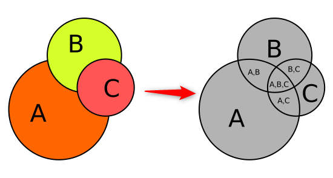
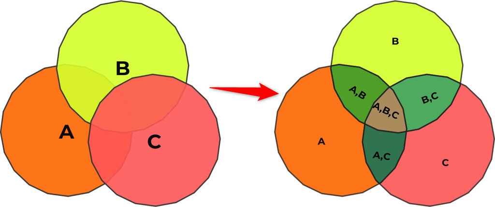
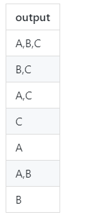
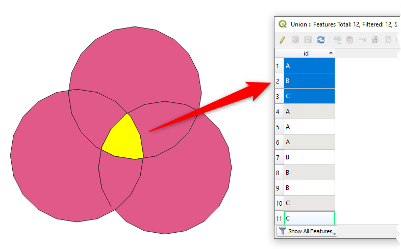
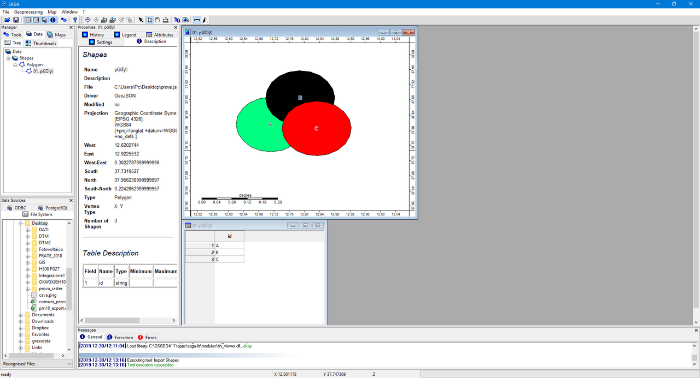
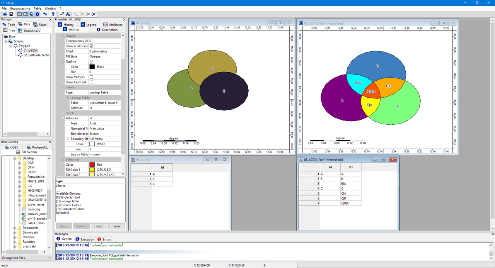

- [&quot;Unire&quot; i poligoni di un layer con grande semplicità: è un lavoro (soltanto?) per mapshaper](#quotunirequot-i-poligoni-di-un-layer-con-grande-semplicità-è-un-lavoro-soltanto-per-mapshaper)
  - [Unione dei poligoni di un layer con mapshaper](#unione-dei-poligoni-di-un-layer-con-mapshaper)
- [Altre modalità](#altre-modalità)
  - [GeoPandas](#geopandas)
  - [QGIS](#qgis)
  - [SQL](#sql)
  - [SAGA](#saga)
  - [R](#r)
- [Per concludere](#per-concludere)

# "Unire" i poligoni di un layer con grande semplicità: è un lavoro (soltanto?) per mapshaper

Quando si lavora con dati spaziali uno degli obiettivi può essere quello di creare nuove geometrie in base a come si sovrappongono fra loro. Queste procedure sono spesso indicate usando il **linguaggio** degli **insiemi**: intersezione, **unione** e differenza.

Qui sotto un'immagine con alcune delle operazioni "classiche" (questa e il testo introduttivo dalla [guida](http://geopandas.org/set_operations.html) di GeoPandas).


In questo articolo verrà descritta una di queste e in particolare l'**unione**. È un'operazione realizzabile in diverse modalità e con diversi strumenti, ma diventa abbastanza complessa e/o non realizzabile se l'obiettivo è:

- realizzare l'unione tra oggetti di **uno stesso *layer* di input**;
- produrre in *output* non soltanto l'**unione** delle geometrie, ma anche quella degli **attributi**, sempre in base alla sovrapposizione delle geometrie.

Nell'immagine di sotto un esempio: a sinistra le geometrie di *input* e a destra l'output. I perimetri delle aree fanno da "lama" di ritaglio e laddove le aree si sovrappongono devono essere trasferiti gli attributi di input (in questo esempio i valori `A`, `B` e `C`).



Un'applicazione con cui è molto semplice realizzare quanto descritto è il fantastico [**mapshaper**](https://github.com/mbloch/mapshaper). È uno  strumento scritto in JavaScript, per modificare file Shapefile, GeoJSON, TopoJSON, CSV e altri formati, molto noto per le sue eccellenti doti nella semplificazione di geometrie.<br>
È uno strumento che fa molto molto di più e questo articolo è l'occasione per mostrarne una.

A [**Totò Fiandaca**](https://pigrecoinfinito.com/) (grazie mille) si deve la redazione del testo che descrive come fare la cosa con [QGIS](https://qgis.org) e tramite SQL geografico (in particolare con [SpatiaLite](https://www.gaia-gis.it/fossil/libspatialite/index)).

## Unione dei poligoni di un layer con mapshaper

Una volta [installato](https://github.com/mbloch/mapshaper#installation) è utilizzabile o a riga di comando o tramite un'interfaccia web ([questa](https://mapshaper.org/) la versione pubblica ufficiale).

Per replicare l'operazione descritta a seguire è stato predisposto [questo file GeoJSON](https://github.com/aborruso/appunti/raw/master/bozze/unione-mapshaper/inputLayer.geojson) di input d'esempio, che ha un solo campo (`id`) ed è composto da tre poligoni (con valori di `id` pari ad `A`, `B` e `C`).

Questo è il comando tipo da lanciare da shell:

```
mapshaper -i ./inputLayer.geojson -mosaic calc='output=collect(id).toString()' -o ./output.geojson
```

Per punti:

- con `-i` si imposta il file di *input*;
- poi il comando da eseguire - [`-mosaic`](https://github.com/mbloch/mapshaper/wiki/Command-Reference#-mosaic) - che in questo caso è appunto l'unione dei poligoni;
- al comando `mosaic` si associa l'opzione [`calc`](https://github.com/mbloch/mapshaper/wiki/Command-Reference#-calc), che consente di eseguire calcoli nelle aggregazioni molti-a-uno, utilizzando espressioni JavaScript. In questo caso viene generato un nuovo campo denominato `output`, in cui vengono aggregati i valori del campo `id` nei poligoni di intersezione risultanti;
- infine si definisce con `-o` il file di output.

Nell'immagine di sotto è rappresentato il processo. Si veda ad esempio come al poligono centrale, frutto dell'interesezione geometrica di tutti e tre i poligoni di input, venga associato il valore `A,B,C`.



In termini di geometrie si avranno 7 record di *output* (corrispondenti alle 7 interesezioni geometriche possibili) con questi attributi:



Tantissimi i campi di applicazione di un processo come questo. Questi tre poligoni potrebbero essere gli areali "colpiti" dalla diffusione di inquinanti da tre punti sorgente, oppure le aree che distano una determinata distanza da una fontanella d'acqua potabile, ecc..<br>
L'unione, con intersezione geometrica e aggregazione di attributi, consente di produrre un *output* in cui è possibile leggere per ogni area il cotributo di tutti i poligoni di `input`.

# Altre modalità

Come dicevo in apertura, tutto questo è fattibile in altre modalità, ma non mi risulta ce ne sia una così semplice in altri ambienti. A seguire qualche esempio.

## GeoPandas

[**GeoPandas**](https://geopandas.readthedocs.io/en/latest/) è un progetto *open source* per semplificare il lavoro con i dati geospaziali in Python. È una gran bella libreria!

Consente di eseguire il [processo di unione](https://geopandas.readthedocs.io/en/latest/set_operations.html) (e altri), ma di base è pensato per essere eseguito tra due *layer* distinti di *input*.<br>
A seguito di [una *issue*](https://github.com/geopandas/geopandas/issues/1116) in merito, aperta sul *repository* di progetto, è stata fornita questa risposta, in cui si evidenzia come non ci sia un modo diretto per farlo:

>[...]there is right now no direct way to do this in geopandas. You could do a "cumulative" intersection manually rather easily in a loop, but that would need some more complexity to keep track of the values.[...]

È stato per l'occasione creato un bel [*notebook*](https://nbviewer.jupyter.org/gist/jorisvandenbossche/3a55a16fda9b3c37e0fb48b1d4019e65) in cui è mostrato come sia possibile eseguire l'intersezione tra i poligoni sovrapposti; da notare la maggiore complessità e sopratutto come comunque non sia gestita l'aggregrazione molti-a-uno degli attributi (nel senso che c'è da scrivere questa parte di codice).

## QGIS

A partire dalla versione [QGIS 3.2 Bonn](https://qgis.org/it/site/forusers/visualchangelog32/) è disponibile un geoalgoritmo `Union` che svolge la parte geometrica di ritaglio del processo descritto sopra, ma non raggruppa le geometrie omologhe e di conseguenza gli attributi.<br>
Una singola area condivisa tra `n` poligoni sarà ritagliata e produrrà in *output* `n` elementi geometrici. Nell'immagine di sotto ad esempio, in corrispondenza dell'area selezionata in giallo, tre *record* e tre geometrie; complessivamente così verranno quindi prodotti 12 *record*.



Per raggruppare le geometrie e gli attributi occorre un altro passaggio, oppure creare un modello grafico, come quello che trovate [qui](./overlayUnion.model3); in questo si utilizzano anche lo *snapping* e la riparazione delle geometrie, che servono in casi molto più complessi di quello attuale.

La *query* utilizzata nel modello è la seguente:

```sql
SELECT group_concat ("id") AS ID, st_union (geometry) AS geometry
FROM input1
GROUP BY geometry
```

Fatto il raggruppamento si avranno in *output* ancora una volta 7 record.

## SQL

Non esiste una funzione di **SQL** spaziale (SpatiaLite o PostGIS) che risolva facilmente la cosa; occorre analizzare *step by step* il da farsi:

1. estrarre i perimetri dai poligoni di input;
2. estrarre i punti di intersezione dei perimetri delle varie feature;
3. aggiungere i punti alla geometria dei perimetri;
4. splittare la geometria dei perimetri;
5. poligonalizzare a partire dai perimetri splittati;
6. associare gli attributi alle varie geometrie poligonalizzate.

Ad esempio in ambiente SpatiaLite si potrebbe partire con l'importazione del file di esempio:

```bash
# importa file inputLayer e crea file spatialite
ogr2ogr -append -t_srs EPSG:4326 -f SQLite ./dbOverlayUnion.sqlite ./inputLayer.geojson -nln "inputLayer" -dsco SPATIALITE=YES
```

E infine lanciare la seguente *query*:

```sql
-- algoritmo proiezioni, the SpatiaLite way
-- di Salvatore Fiandaca
-- e-mail: pigrecoinfinito@gmail.com
-- è stato di aiuto: http://blog.cleverelephant.ca/2019/07/postgis-overlays.html

-- crea geotabella polygonize
CREATE TABLE polygonize AS
SELECT St_Polygonize(t.geom) as geom
FROM
(SELECT id, St_Union(st_boundary(geometry)) as geom
FROM inputLayer) t;
SELECT RecoverGeometryColumn('polygonize','geom',4326,'MULTIPOLYGON','XY');

-- crea geotabella dalle componenti elementari della geotabella polygonize
SELECT DropGeoTable('elementi');
SELECT ElementaryGeometries( 'elementi' ,'geom' , 'polygonize' ,'out_pk' , 'out_multi_id', 1 ) as num, 'polygon splitted' as label;

-- crea poligoni di output con attributi
SELECT DropGeoTable( "OUTPUT");
CREATE TABLE OUTPUT AS
SELECT Group_Concat(id) as id, e.geom
FROM inputLayer p, elementi e
where st_intersects (ST_PointOnSurface(e.geom), p.geometry) = 1
GROUP BY e.geom;
SELECT RecoverGeometryColumn('OUTPUT','geom',4326,'POLYGON','XY');

-- aggiorna statistiche e VACUUM
UPDATE geometry_columns_statistics set last_verified = 0;
SELECT UpdateLayerStatistics('geometry_table_name');
VACUUM;
```

In *output* ancora una volta 7 record.

## SAGA

*Sezione a cura di [Ludovico Frate](https://www.linkedin.com/in/ludovico-frate-a387aa57/) (grazie).*

In SAGA GIS è possibile utilizzare il comando Polygon Self-Intersection per ottenere 7 geometrie (records) derivanti dall’unione del vettore originale.<br>
I passaggi da eseguire sono:

1. Importazione del file geojson utilizzando il comando Import Shapes (Tools -> Import/Export->GDAL/OGR->Import Shapes);



2. Eseguire l’unione eseguendo il comando Polygon Self-Intersection (Tools -> Shapes->Polygons->Polygons Self-Intersection) ed inserire in Polygons il geojson appena caricato, in identifier la colonna id.



In output i soliti 7 record.

## R

*Sezione a cura di [**Andrea Zedda**](https://www.facebook.com/andria.tzedda) (grazie).*

In [**R**](https://www.r-project.org/), sfruttando le librerie `sf` e `dplyr`:

```
library(sf)
library(dplyr)
s <- st_read("inputLayer.geojson")
s %>% st_intersection() %>%
mutate(att=sapply(origins,
function(x) paste0(as.character(s$id)[x], collapse = ",")))
```

In output quanto atteso.

# Per concludere

L'autore di mapshaper è [**Matthew Bloch**](https://github.com/mbloch). È uno sviluppatore con doti al di fuori del comune, sia in termini professionali, che in termini di attitudine all'ascolto e allo scambio con gli altri.<br>
Questa modalità così semplice per eseguire questo processo di unione è stata introdotta da poco ([il 18 novembre 2019](https://github.com/mbloch/mapshaper/releases/tag/v0.4.141)), grazie a una [richiesta ricevuta](https://github.com/mbloch/mapshaper/issues/353) nel *repository* del progetto (da notare che anche precedentemente fosse semplice realizzare la cosa).

Non vi resta che installare mapshaper e apprezzarne le grandi potenzialità.

Un **grande grazie** a **Matthew** per quello che realizza e mette a disposizione e per il modo in cui lo fa!
